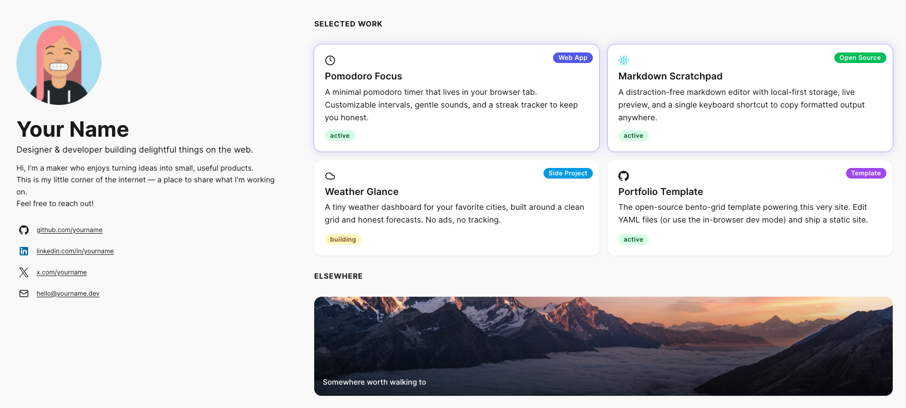

# MosaicFolio



A Next.js bento-grid portfolio template. No backend, no database, no environment variables. Customize it visually in your browser, or hand it to an AI assistant and describe what you want.

→ [Live example](https://adamalet.fr)

---

## What it is

A static portfolio built around a bento tile grid. You add your projects, links, and photos — everything else is handled by the template.

**WYSIWYG editor, zero CMS.** The dev server doubles as a content editor. Click the floating **✎ Edit** button and every tile becomes editable in-place: click text to rename, drag to reorder, pick a size, add or delete tiles. Changes are saved automatically to the `content/` YAML files. No separate CMS, no admin panel.

**AI-native.** `LLM.md` at the repo root is a complete instruction file for any AI assistant — Claude, Copilot, GPT, Cursor, whatever. Point it at that file and describe what you want in plain language. The AI edits `content/*.yaml` directly. You review the diff, push.

**No backend in production.** The editor API routes only exist in dev (`NODE_ENV=development`). `pnpm build` produces a fully static `out/` directory ready to deploy anywhere.

---

## Local setup

**1.** Fork this repo and clone your fork:

```bash
git clone https://github.com/<you>/my-portfolio.git
cd my-portfolio
```

**2.** Install dependencies:

```bash
pnpm install
```

**3.** Start the dev server:

```bash
pnpm dev
```

Opens at [http://localhost:3000](http://localhost:3000).

**4.** Activate dev mode — click the **floating ✎ Edit button** at the bottom-center of the page. Every tile turns editable. Changes are saved automatically.

---

## Dev Mode

| Action                          | How                                                                                                    |
| ------------------------------- | ------------------------------------------------------------------------------------------------------ |
| Toggle dev mode                 | Click the ✎ Edit button (bottom-center), or append `?dev=true` to the URL (persists in `localStorage`) |
| Edit a text field               | Click the value — type, then `Enter` to save or `Escape` to cancel                                     |
| Change a project status or size | Click the badge / hover the tile for controls                                                          |
| Toggle the Featured style       | Open a project's edit modal and flip the `Featured` switch                                             |
| Reorder tiles                   | Grab the `⠿` handle (top-right of the tile) and drop it                                                |
| Add a tile                      | Click the floating `+` button (bottom-right) — Card / Section / Image                                  |
| Delete a tile                   | Hover the tile and click the red trash icon                                                            |
| Exit dev mode                   | Click `Exit Edit` (bottom-center), or press `Escape`                                                   |

Dev mode is entirely local. The live site is a pure static export with no editor surface.

---

## Hand it to an AI

Open the repo in any AI-aware editor — Claude Code, Cursor, VS Code with Copilot, or paste files into a web chat — and point the AI at [`LLM.md`](./LLM.md). That file documents every field, every valid value, and every error case. Then describe what you want:

> _"Read LLM.md. Add a project titled 'Habit Garden', status `active`, size `square`, stack `[Swift, SwiftUI]`, and append it to the layout."_

The AI edits `content/*.yaml` directly. Run `pnpm validate` (~700 ms, schema-only) to catch errors fast, or `pnpm build` for a full check.

---

## OG image

`pnpm build` automatically generates `public/og.png` before building (the `prebuild` script runs `scripts/generate-og.ts` for you). It reads your name, tagline, accent color, avatar, and social links from `content/` and renders a 1200×630 Open Graph image.

Want to regenerate it on its own — for instance after tweaking your tagline or accent color without doing a full build? Run:

```bash
pnpm prebuild
```

This writes a fresh `public/og.png` in about a second, no full Next.js build needed.

---

## License

MIT — fork it, ship it, make it yours.
